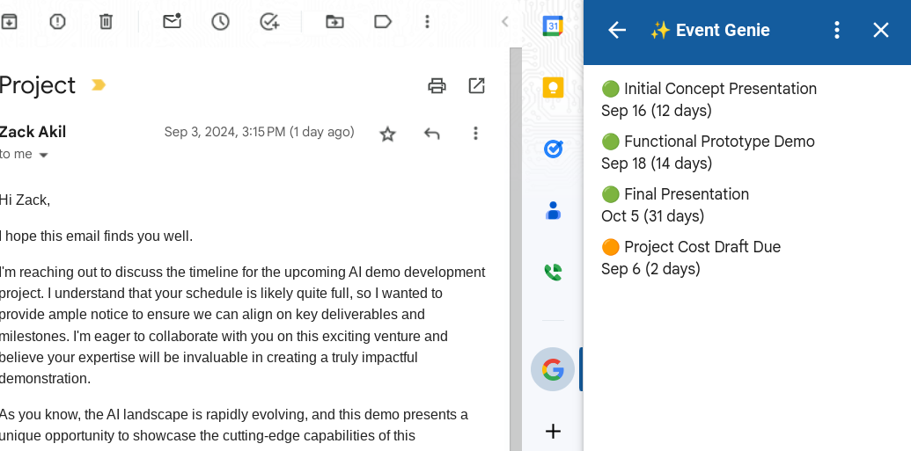

# ✨ Event Genie - Gmail Add-on

Event Genie is a Gmail add-on that helps you effortlessly extract potential calendar events from your emails and add them to your Google Calendar with just a few clicks. 

## Features

* **AI-powered Event Extraction:** Leverages the power of Google's Gemini AI model to intelligently identify and extract dates, times, titles, descriptions, and locations of potential events from your email content.
* **Smart Suggestions:** Presents you with a list of suggested calendar events, ordered by relevance, making it easy to choose the ones you want to add to your calendar.
* **Seamless Calendar Integration:** Allows you to add extracted events directly to your Google Calendar with a single click, eliminating the need for manual entry.
* **User-friendly Interface:** Provides a simple and intuitive card-based interface within Gmail, making it easy to interact with the add-on.
* **Contextual Awareness:** Considers the date the email was received to provide more accurate event suggestions.
* **Urgency Indicators:** Uses emojis (🟢, 🟠, 🔴) to visually indicate the urgency of events based on how soon they are approaching.

## How it Works

1. **Open an Email:** Open an email containing information about potential events.
2. **Click "Extract Calendar Events":** Click the "🔍 Extract Calendar Events" button in the add-on sidebar.
3. **Review Suggestions:** Event Genie will analyze the email content and present you with cards displaying suggested calendar events.
4. **Add to Calendar:** Click the "📅 Add Event to Calendar" button on the card for each event you want to add.
5. **Done!** The event will be added to your Google Calendar, and you'll see a confirmation message with a link to the event.

## Installation/ Development Setup

This add-on is built using Google Apps Script. To get started with development:

1. **Clone the Repository:** Clone this GitHub repository to your local machine.
2. **Open in Apps Script:** Open the `Gemini.gs`, `Code.gs`, `Auth.gs`, and `appsscript.json` files in the Google Apps Script editor.
3. **Configure Service Account:**
   - Create a service account in your Google Cloud project and grant it the "Vertex AI Predictor" role.
   - Download the service account's JSON key file.
   - Replace the placeholder values in `Auth.gs` (SERVICE_ACCOUNT object) with your service account's details.
4. **Deploy as Gmail Add-on:** Deploy the script as a Gmail add-on from the Apps Script editor.
